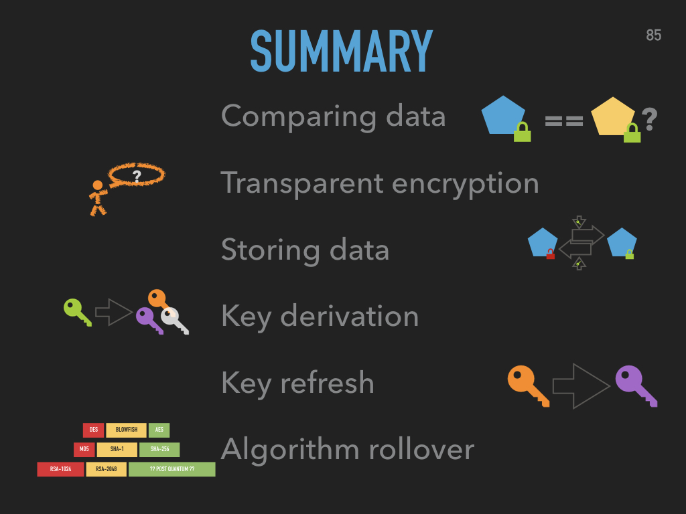

Sleep Better With Content Encryption
======================================

Cryptography can secure data even when the database has left the company. Effective cryptography not only makes attackers life harder, it also provides sound sleep for management, OPs, and everybody else responsible for data.

---

_You sweat, a wave of nausea hits you. In two hours you talk to your bosses-bosses-boss. Why? You have been hacked. You had all the fancy acronyms like SAST, DAST, SCA, WAF, SIEM, and several you are pretty sure the IT team just made up on the spot. You had a pentest. Twice! And still they managed to hack the application. YOUR application._

“I will make it”, you say to yourself, and prepare your slides.
 
_[two very tense hours later]_

The conference room is nice. Nicer than the ones you are used to know. Also colder. Much colder. Or so it seems.
 
"Yes, we have been hacked. The attackers dumped our customer database and took it with them. 
 
The attackers even managed to modify customers payment data with the intent to order our products on other customers’ bill. To do so, they randomly swapped the payment data between customers and then ordered expensive products. That would have been quite ingenious, if it had worked: we would be swamped with wrongly assigned bills and it would take months to sort it all out and sieve out the actual malicious orders. By that time, all traces of the attackers would be cold and gone.
 
Luckily, we were prepared. 
 
All PII in the customer records was encrypted in our application. Although the attackers managed to dump the whole database table, it contained only encrypted data with no hope of decryption. We could practically hear the sigh of relief of our DPO, when we told her.
 
The payment data was cryptographically linked to the customer. Whilst that did not prevent the manipulation of the database, all manipulated records were instantly detected by the now failing integrity check. We had to restore the table from backup, but not a single wrongly billed order was executed."
 
_[later in the evening, with a good glass of wine]_
 
"And this, my friend, was the moment I got an approving nod from my bosses-bosses-boss"

---

But there is another, equally important side:
Microservices, Big Data, Machine Learning — these are the buzzwords that make a developers eye gleam. In reality these are often replaced by _Integrating legacy systems_, _file based data exchange via ftp_, and _laws & compliance_.

Encryption and other cryptographic measures can help bring together technology and the ugly side of business. Though they are not for the careless to implement. This slide deck will give you a very short introduction into the why and how of implementing cryptography into your applications.

You might even push _snooze_ on your alarm clock when the next _Heartbleed_ hits the news.

Where
-----
* [18. Gulaschprogrammiernacht (CCC Karlsruhe)](https://pretalx.entropia.de/gpn18/talk/CEQKHF/) ([recording](https://media.ccc.de/v/gpn18-129-practical-cryptography-patterns))
* [German Perl Workshop 2018](http://act.yapc.eu/gpw2018/talk/7310)
* [FrosCon 2017](https://programm.froscon.de/2017/events/1912.html) [recording](https://media.ccc.de/v/froscon2017-1912-practical_content_encryption)
* [Java User Group Cologne 2017](https://www.xing.com/events/jugc-schlafen-inhaltsverschlusselung-1803807)

Slides
==========

Here are some example slides. The whole presentation (Keynote) can be found [here](./slides/Neuhalfen_Content-Encryption.key). A [pdf export](./Neuhalfen_Content-Encryption.pdf) is also available. You can view the slides [in your browser](https://neuhalje.github.io/presentation_content-encryption/).

LICENSE
=========

[CC BY-SA 4.0](https://creativecommons.org/licenses/by-sa/4.0/)
